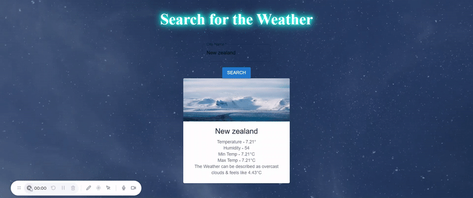
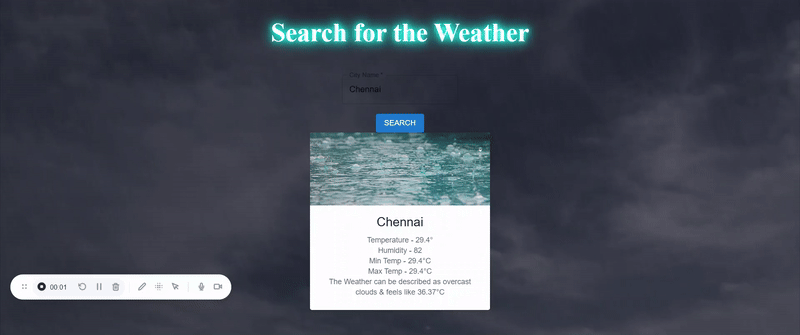

# ⛅ Weather App with Dynamic Backgrounds

This React-based weather app lets you search for any city and view real-time weather information using the **OpenWeatherMap API**. It features **dynamic background videos and card previews** that change based on the current weather conditions.

---

## 🌟 Features

- 🌆 Search weather for any city
- 🌡️ Displays temperature, humidity, and weather description
- 🎞️ Dynamic background video (sunny, cold, rain)
- 📦 Uses OpenWeatherMap API
- 🎨 Material UI for clean, responsive design
- 📷 Weather condition-specific GIF previews in README

---

## 🖼️ App Preview (GIFs)

### ☀️ Summer / Hot Weather

### ❄️ Cold / Winter Weather

### 🌧️ Rainy Weather

---

## 🛠️ Tech Stack

- **React** (Functional Components, Hooks)
- **Material UI** (MUI)
- **JavaScript (ES6+)**
- **OpenWeatherMap API**
- **HTML5 / CSS3**

---
